# Разметка для примеров

```html
<body>
  <div>Для писем и газет</div>
  <div class="flex-container">
    <div class="flex-element el-1">Раз прислал мне</div>
    <div class="flex-element el-2 large">барин чаю</div>
    <div class="flex-element el-3">и велел</div>
    <div class="flex-element el-4">его сварить</div>
    <div class="flex-element el-5">а я отроду не знаю</div>
    <div class="flex-element el-6">как хороший чай варить.</div>
  </div>
</body>
```

```css
.flex-container {
  display: flex;
  flex-direction: row;
  /* flex-wrap: wrap; */
  /* justify-content: flex-start; */
  /* align-items: stretch; */
  /* align-content: normal; */
  background-color: aquamarine;
  /* height: 150px; */
  /* width: 150px; */
  margin: 10px;
  /* column-gap: 15px; */
  /* row-gap: 15px; */
}

.flex-element {
  background-color: bisque;
  padding: 10px;
  border: 1px solid black;
}

.large {
  font-size: 35px;
}

.el-1 {
  /* flex-grow: 1; */
  /* flex-shrink: 1; */
}
```

# Контейнер и элемент

* Флекс-контейнер (далее просто контейнер) - это элемент, для которого установлено свойство:

  ```css
  display: flex;         /* Контейнер ведет себя как блочный элемент  */
  display: inline-flex;  /* Контейнер ведет себя как строчный элемент */
  ```

* Флекс-элемент - элемент, который *непосредственно* вложен во флекс-контейнер. На эти элементы действуют правила, заданные в контейнере.

Когда контейнер как блочный, он занимает всю доступную ширину вьюпорта:


Когда как строчный, то контейнер занимает только нужную ему ширину. Поэтому рядом могут поместиться несколько контейнеров:


# Свойства контейнера

## flex-direction, Направление оси

Ось определяет расположение элементов в контейнере. Осей две:

* Основная (main) - может быть горизонтальной или вертикальной.
* Побочная (поперечная, cross) - идет перпендикулярно основной. Т.е. если основная - горизонтальная, то побочная - вертикальная, и наоборот.

Ось задается для контейнера:

```css
.flex-container {
  flex-direction: row;  /* По умолчанию */
}
```

Т.о. можно сказать, что контейнер может быть `горизонтальным` или `вертикальным`.

### Горизонтальный контейнер, row, row-reverse

```css
flex-direction: row;  /* Элементы идут от начала строки к концу */
flex-direction: row-reverse;  /* Элементы идут конца строки к началу */
```

В горизонтальном контейнере элементы располагаются в `строку`. Строка занимает всю ширину контейнера:

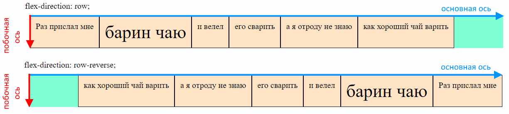

### Вертикальный контейнер, column, column-reverse

```css
flex-direction: column;  /* Элементы идут от начала столбца к концу */
flex-direction: column-reverse;  /* Элементы идут конца столбца к началу */
```

В вертикальном контейнере элементы располагаются в `столбец`. Столбец занимает всю высоту контейнера:

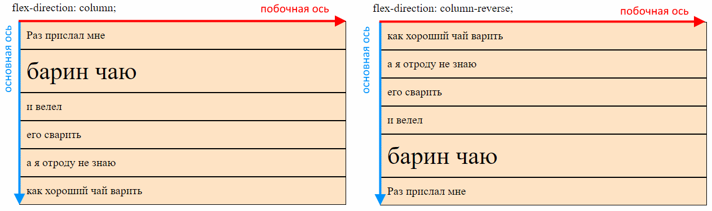

## flex-wrap, Перенос элементов

```css
.flex-container {
  flex-wrap: nowrap;  /* По умолчанию */
}
```

Задает алгоритм переноса элементов на следующую строку \ столбец, если они не вмещаются в текущую \ ий.

### nowrap, Без переноса

```css
flex-wrap: nowrap;
```

Когда перенос выключен, то элементы в горизонтальном контейнере будут пытаться максимально сжаться, чтобы влезть в доступную ширину. Если же контейнер слишком узкий, то элементы вылезут за его пределы. Переполнение может случиться, если например сузить окно браузера (ну или явно задать узкую ширину):


В вертикальном контейнере переполнение столбца может возникнуть только если ограничить высоту контейнера. Иначе контейнер просто будет расти по мере добавления новых элементов:

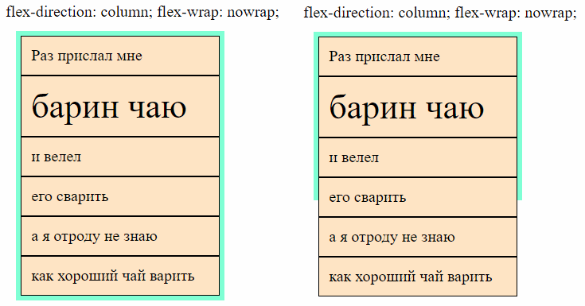

### wrap, С переносом

```css
flex-wrap: wrap;
```

С включенным переносом в горизонтальный контейнер будут добавляться новые строки, когда очередному элементу не хватает места, чтобы вместиться в текущую строку. А в вертикальный контейнер, соответственно, будут добавляться новые столбцы:


Высота каждой строки определяется индивидуально, по размеру элементов, которые в ней находятся. Например, в горизонтальном контейнере самый большой элемент "барин чаю" находится в первой строке, поэтому она выше, чем вторая и третья строка. Общая высота контейнера складывается из высот всех строк. Все элементы в строке по умолчанию растягиваются на высоту строки.

> P.S. здесь я в первой строке сделал выравнивание, чтобы элемент "Раз прислал мне" принял свой естественный размер и стало видно, что элемент "барин чаю" самый большой. Самый большой он, кстати, за счет увеличенного размера шрифта).

В вертикальном контейнере самый широкий элемент "как хороший чай варить. Взял я чай..." находится во втором столбце, поэтому он шире первого столбца. По ширине контейнер занимает все доступное место, поэтому элементы будут тянуться вширь пропорционально своим исходным размерам.

> P.S. здесь я в элемент во втором столбце добавил разрывы, чтобы не складывалось впечатление, что в вертикальном контейнере есть строки, а то верхние элементы очень уж ровно стояли друг напротив друга в линию).

### wrap-reverse, С обратным переносом

```css
flex-wrap: wrap-reverse;
```

Тот же принцип, что в row-reverse и column-reverse. Только там инвертируются элементы внутри строк \ столбцов, а тут сами строки и столбцы. Горизонтальный контейнер:

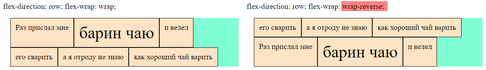

Вертикальный контейнер:

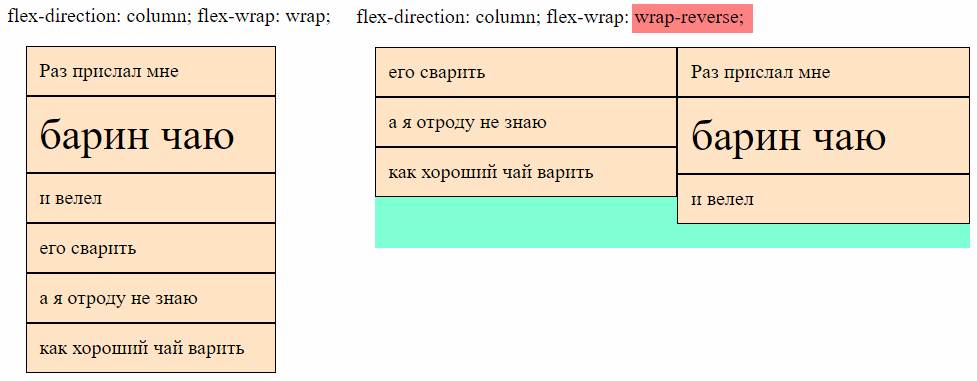

## flex-flow, Направление оси + перенос элементов

`flex-flow` это комбинированное свойство, позволяющее разом задать и ось, и алгоритм переноса в формате `ось алгоритм-переноса`:

```css
.flex-container {
  flex-flow: row wrap;
}
```

## gap, Расстояние между элементами

```css
.flex-container {
  column-gap: 20px;
  row-gap: 20px;
  gap: 20px 40px;  /* row-gap + column-gap */
}
```

Горизонтальный контейнер:


Вертикальный контейнер:


Названия специфические, потому что номинально в горизонтальном контейнере нет столбцов, а в вертикальном нет строк, но тем не менее оба свойства работают и там, и там. В данном случае можно абстрагироваться от этого факта и воспринимать строки и столбцы визуально, а не концептуально.

# Выравнивание

## Выравнивание элементов внутри строк \ столбцов

### justify-content, По основной оси

В строках \ столбцах после размещения элементов может остаться свободное место. Это дает нам возможность по-разному выровнять элементы.

► Горизонтальный контейнер:


► Вертикальный контейнер:

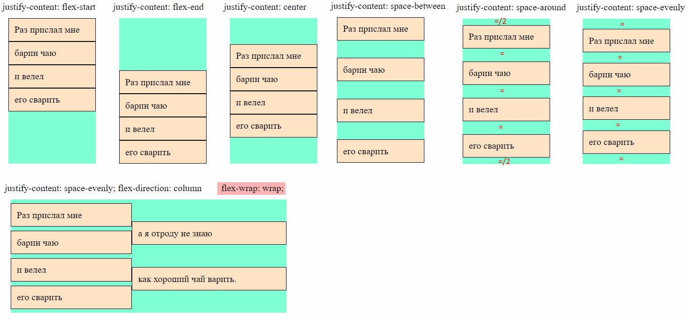

► Комментарии:

* `justify-content: flex-start;` - дефолт. Элементы жмутся к началу основной оси.
* `justify-content: flex-end;` - Элементы жмутся к концу основной оси.
* `justify-content: center;` - Элементы жмутся к центру основной оси.
* `justify-content: space-between;` - Боковые элементы прижимаются к краям основной оси, а остальные делят оставшееся место поровну.
* `justify-content: space-evenly;` - Между всеми элементами одинаковое расстояние, по бокам такие же отступы.
* `justify-content: space-around;` - Между всеми элементами одинаковое расстояние, а по бокам половина этого расстояния.

### align-items, По поперечной оси

Если элементы в строке \ столбце имеют разные размеры, то по умолчанию все элементы растягиваются до самого высокого \ широкого и т.о. занимают всю высоту строки \ ширину столбца. Однако можно их выровнять, чтобы они приняли свои естественные размеры.

► Горизонтальный контейнер:


► Вертикальный контейнер:

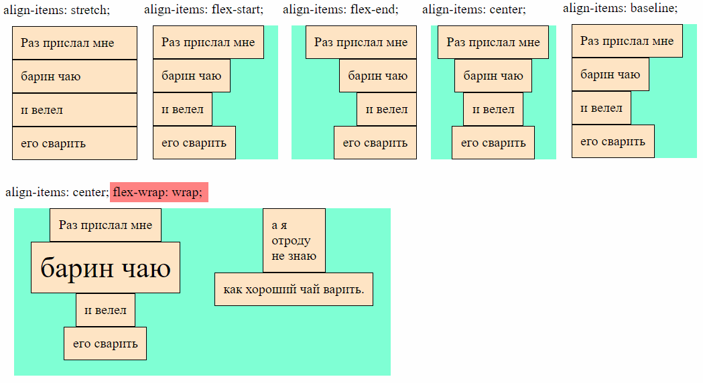

► Комментарии:

* `align-items: stretch;` - дефолт. Элементы растягиваются на всю высоту строки \ ширину столбца.
* `align-items: flex-start;` - Элементы жмутся к началу поперечной оси (к верху строки \ левому краю столбца).
* `align-items: flex-end;` - Элементы жмутся к концу поперечной оси (к низу строки \ правому краю столбца).
* `align-items: center;` - Элементы располагаются по центру поперечной оси (по вертикали по центру строки \ по горизонтали по центру столбца).
* `align-items: baseline;` - В горизонтальном контейнере выравнивает блоки по baseline, а в вертикальном контейнере не понятно. Возможно, что не работает и ведет себя как один из пунктов выше.

Baseline означает воображаемую линию, на которой лежит текст. Всякие крючки вниз, вроде как у букв `р, д, у`, и вверх как у `б, d, k` и верхние части больших букв, возвышающиеся над маленькими, находятся за пределами baseline. Понимание, что такое baseline, пригодится, чтобы понять как работает выравнивание элементов по baseline'у.


## align-content, Выравнивание строк \ столбцов внутри контейнера

Как было сказано в разделе про перенос, строки по умолчанию занимают всю высоту контейнера, а столбцы - всю ширину. И те, и другие делят пространство не поровну, а *растягиваются* пропорционально:


Мы можем выравнивать не только элементы внутри строк \ столбцов, но и сами строки и столбцы. Тогда они не будут растягиваться на всю высоту \ ширину контейнера, а выстроятся соответственно указанному выравниванию (высоту контейнера надо задать вручную, чтобы увидеть эффект, т.к. из-за того что она рассчитывается как сумма высот строк, в контейнере не будет лишнего места по вертикали).

После выравнивания строк \ столбцов, контейнер можно визуализировать вот так:

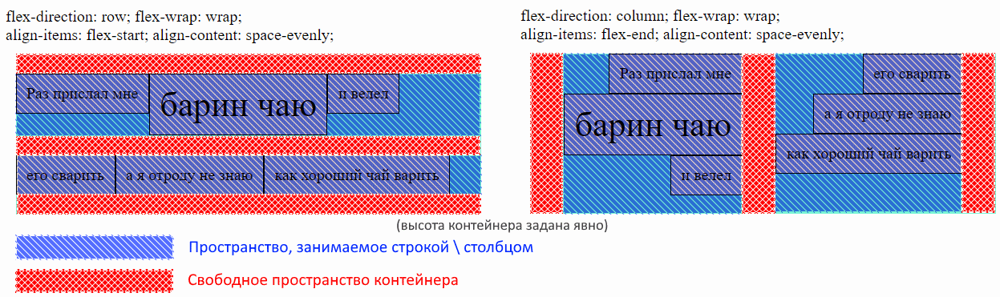

Здесь одновременно задано выравнивание и самих строк \ столбцов, и элементов внутри них.

► Горизонтальный контейнер (заштрихованным показано свободное пространство контейнера):

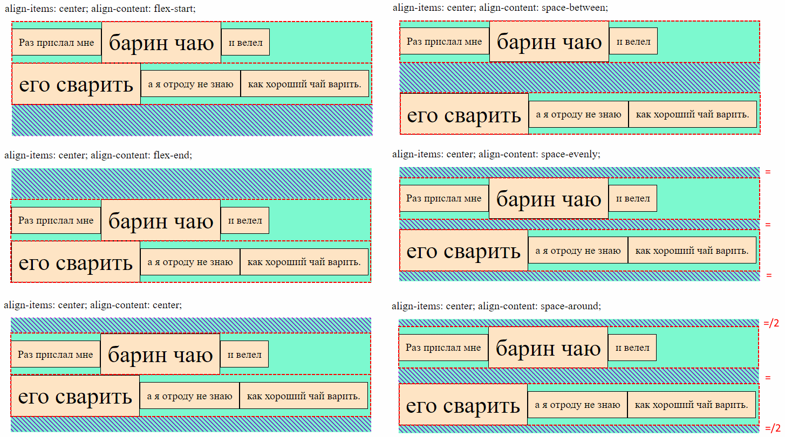

► Вертикальный контейнер (заштрихованным показано свободное пространство контейнера):


► Комментарии:

* `justify-content: flex-start;` - Строки \ столбцы жмутся к началу основной оси.
* `justify-content: flex-end;` - Строки \ столбцы жмутся к концу основной оси.
* `justify-content: center;` - Строки \ столбцы жмутся к центру основной оси.
* `justify-content: space-between;` - Боковые строки \ столбцы прижимаются к краям основной оси, а остальные делят оставшееся место поровну.
* `justify-content: space-evenly;` - Между всеми строками \ столбцами одинаковое расстояние, по бокам такие же отступы.
* `justify-content: space-around;` - Между всеми элементами одинаковое расстояние, а по бокам половина этого расстояния.

## Резюме по выравниванию

В флекс-контейнерах всего есть три вида выравнивания:

| Свойство выравнивания | Значение по умолчанию | Что делает                                                   | Документация                                                 |
| --------------------- | --------------------- | ------------------------------------------------------------ | ------------------------------------------------------------ |
| `justify-content`     | `flex-start`          | Выравнивание *элементов* внутри строки \ столбца по *основной* оси. | [MDN](https://developer.mozilla.org/en-US/docs/Web/CSS/justify-content) |
| `align-items`         | `stretch`             | Выравнивание *элементов* внутри строки \ столбца по *поперечной* оси. | [MDN](https://developer.mozilla.org/en-US/docs/Web/CSS/align-items) |
| `align-content`       | `normal`              | Выравнивание целиком *строк* \ *столбцов* по поперечной оси. | [MDN](https://developer.mozilla.org/en-US/docs/Web/CSS/align-content) |
| `justify-items`       |                       | Не работает для флексов                                      | [MDN](https://developer.mozilla.org/en-US/docs/Web/CSS/justify-items) |

Наглядная демонстрация, за выравнивание чего отвечает каждое свойство:

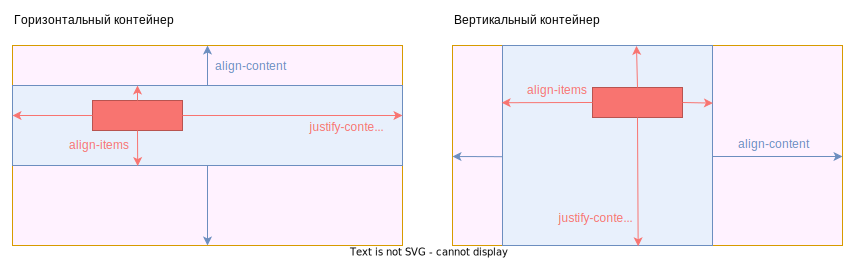

# Свойства элемента

## Растягивание и сужение

На практике:

* Растягивание обычно у всех элементов оставляют в 0, а одному элементу ставят в 1, если нужно растянуть его на *все доступное место* флекс-контейнера.
* Сужение обычно меняют на 0 тому элементу, для которого нужно оставить его естественные размеры.

### flex-grow, Растягивание

```css
.flex-element {
  flex-grow: 0;  /* По умолчанию */
}
```

Определяет, будет ли элемент пытаться растянуться, чтобы занять все свободное место по основной оси. Возможные значения - любое целое число больше или равное 0. При 0 элемент не пытается растянуться вообще, будет занимать свой естественный размер. При других значениях результат зависит, у какого элемента что указано. Если всем поставить 1, тогда они попытаются растянуться (пропорционально исходным размерам), чтобы занять все пространство по основной оси. Если у всех будет 1, а у кого-то 5, то "единичные" растянутся пропорционально, а "пятерной" попробует растянуться в пять раз больше них. Ключевое слово "попробует", потому что если другим не хватит места, то он не будет тянуться дальше остальным в ущерб.

► Горизонтальный контейнер:


► Вертикальный контейнер:


### flex-shrink, Сужение

```css
.flex-element {
  flex-shrink: 1;  /* По умолчанию */
}
```

Определяет, будет ли элемент пытаться сжаться, если в контейнере не хватает места для всех элементов. Возможные значения 0 и больше, принцип такой же как у растягивания, эти цифры - коэффициенты, определяющие пропорции между элементами.

Элемент не будет будет сужаться меньше, чем нужно для размещения контента. Грубо говоря, он может сузиться до самого длинного слова в нем, но не больше. Чтобы он мог сузиться сильнее, надо установить ему `min-width` (или `min-height`, если контейнер вертикальный).

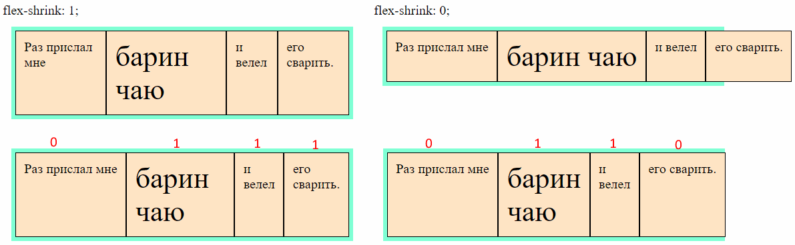

## flex-basis, Базовый размер

```css
.flex-element {
  flex-basis: auto;  /* По умолчанию */
  flex-basis: 100px;
}
```

Задает элементу *базовый* размер. Это "стартовый" размер, который контейнер устанавливает элементу до начала распределения пространства между вложенными элементами. Он перекрывает размеры, заданные через width или height. Если направление элементов горизонтальное, то flex-basis задает ширину и перекрывает width, если вертикальное - то flex-basis задает высоту и перекрывает height.

* Значение `auto` - элемент изначально будет своего естественного размера.
* Значение `0` ([обсуждение на so](https://stackoverflow.com/questions/47578958/the-difference-between-flex-basis-auto-and-0-zero)) - элемент изначально сожмется до минимально возможного размера, при котором контент еще может влезть в него. Внимание! Это не то же самое, что установка width: 0. При width: 0 элементы сожмутся в ноль и фактически их контент визуально наложится друг на друга.


## flex, Растягивание + сужение + базис

```css
.flex-element {
  flex: 0 1 auto;  /* flex-grow, flex-shrink, flex-basis (указаны значения по умолчанию) */
}
```

Комбинированное свойство, позволяющее разом задать и растягивание, и сужение, и базовый размер.

Для свойства `flex` есть логичные предустановки, подробнее можно посмотреть [здесь](https://www.w3.org/TR/css-flexbox-1/#flex-common) (хотя как будто я и тут все написал хорошо). Они покрывают большинство стандартных сценариев:

* `flex: initial` === `flex: 0 1 auto` - дефолтное. Пока в контейнере есть свободное место, элемент имеет свои естественные размеры, не расширяется. Когда свободного места нет, он сжимаются.
* `flex: auto` === `flex: 1 1 auto` - когда в контейнере есть свободное место, элемент расширяется. Когда свободного места нет, сужается.
* `flex: none` === `flex: 0 0 auto` - элемент не расширяется, и не сужается, независимо от наличия \ отсутствия свободного места в контейнере.
* `flex: положительное-число` === `flex: положительное-число 1 0` - элемент изначально будет минимального допустимого размера (т.к. flex-basis: 0), и за счет первого коэффициента растянется. Соответственно, если все элементы флекса настроить таким свойством, можно задать им пропорции растягивания. Например, не будет нужды писать нечто вроде `flex: 0 0 50%`, чтобы растянуть два элемента до одинаковой ширины. Можно написать `flex: 1` всем элементам, сколько бы их ни было, и они все будут одинаковой ширины. Все потому, что flex-basis: 0 сделает их равными с точки зрения исходного размера, а flex-grow: 1 скажет растягиваться с одинаковым приоритетом.

## order, Порядок

```css
.flex-element {
  order: 0;  /* По умолчанию */
}
```

Определяет, на каком месте визуально элемент будет находиться среди других элементов контейнера. Значение - любое целое число.

Злоупотреблять порядком и явно назначать его каждому элементу не нужно. На практике обычно используется значение `-1`, если нужно поместить элемент в начало и `1`, если нужно поместить его в конец.

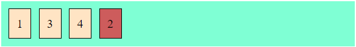

```css
.el-2 {  /* Второй элемент поместим в конец */
  background-color: indianred;
  order: 1;  /* У других элементов order не задан */
}
```
