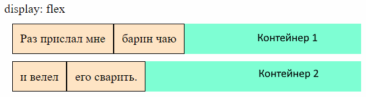

# Контейнер и элемент

* Флекс-контейнер (далее просто контейнер) - это элемент, для которого установлено свойство:

  ```css
  display: flex;         /* Контейнер ведет себя как блочный элемент  */
  display: inline-flex;  /* Контейнер ведет себя как строчный элемент */
  ```

* Флекс-элемент - элемент, который *непосредственно* вложен во флекс-контейнер. На эти элементы действуют правила, заданные в контейнере.

Когда контейнер как блочный, он занимает всю доступную ширину вьюпорта:



Когда как строчный, то контейнер занимает только нужную ему ширину. Поэтому рядом могут поместиться несколько контейнеров:


