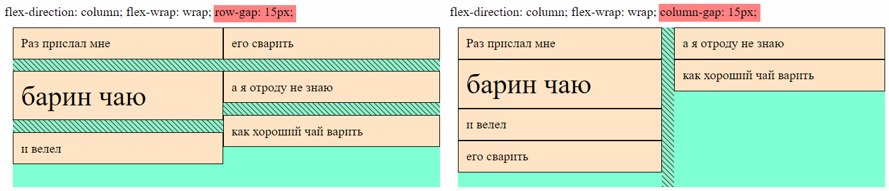

# Свойства контейнера

## flex-direction, Направление оси

Ось определяет расположение элементов в контейнере. Осей две:

* Основная (main) - может быть горизонтальной или вертикальной.
* Побочная (поперечная, cross) - идет перпендикулярно основной. Т.е. если основная - горизонтальная, то побочная - вертикальная, и наоборот.

Ось задается для контейнера:

```css
.flex-container {
  flex-direction: row;  /* По умолчанию */
}
```

Т.о. можно сказать, что контейнер может быть `горизонтальным` или `вертикальным`.

### Горизонтальный контейнер, row, row-reverse

```css
flex-direction: row;  /* Элементы идут от начала строки к концу */
flex-direction: row-reverse;  /* Элементы идут конца строки к началу */
```

В горизонтальном контейнере элементы располагаются в `строку`. Строка занимает всю ширину контейнера:


### Вертикальный контейнер, column, column-reverse

```css
flex-direction: column;  /* Элементы идут от начала столбца к концу */
flex-direction: column-reverse;  /* Элементы идут конца столбца к началу */
```

В вертикальном контейнере элементы располагаются в `столбец`. Столбец занимает всю высоту контейнера:


## flex-wrap, Перенос элементов

```css
.flex-container {
  flex-wrap: nowrap;  /* По умолчанию */
}
```

Задает алгоритм переноса элементов на следующую строку \ столбец, если они не вмещаются в текущую \ ий.

### nowrap, Без переноса

```css
flex-wrap: nowrap;
```

Когда перенос выключен, то элементы в горизонтальном контейнере будут пытаться максимально сжаться, чтобы влезть в доступную ширину. Если же контейнер слишком узкий, то элементы вылезут за его пределы. Переполнение может случиться, если например сузить окно браузера (ну или явно задать узкую ширину):


В вертикальном контейнере переполнение столбца может возникнуть только если ограничить высоту контейнера. Иначе контейнер просто будет расти по мере добавления новых элементов:


### wrap, С переносом

```css
flex-wrap: wrap;
```

С включенным переносом в горизонтальный контейнер будут добавляться новые строки, когда очередному элементу не хватает места, чтобы вместиться в текущую строку. А в вертикальный контейнер, соответственно, будут добавляться новые столбцы:


Высота каждой строки определяется индивидуально, по размеру элементов, которые в ней находятся. Например, в горизонтальном контейнере самый большой элемент "барин чаю" находится в первой строке, поэтому она выше, чем вторая и третья строка. Общая высота контейнера складывается из высот всех строк. Все элементы в строке по умолчанию растягиваются на высоту строки.

> P.S. здесь я в первой строке сделал выравнивание, чтобы элемент "Раз прислал мне" принял свой естественный размер и стало видно, что элемент "барин чаю" самый большой. Самый большой он, кстати, за счет увеличенного размера шрифта).

В вертикальном контейнере самый широкий элемент "как хороший чай варить. Взял я чай..." находится во втором столбце, поэтому он шире первого столбца. По ширине контейнер занимает все доступное место, поэтому элементы будут тянуться вширь пропорционально своим исходным размерам.

> P.S. здесь я в элемент во втором столбце добавил разрывы, чтобы не складывалось впечатление, что в вертикальном контейнере есть строки, а то верхние элементы очень уж ровно стояли друг напротив друга в линию).

### wrap-reverse, С обратным переносом

```css
flex-wrap: wrap-reverse;
```

Тот же принцип, что в row-reverse и column-reverse. Только там инвертируются элементы внутри строк \ столбцов, а тут сами строки и столбцы. Горизонтальный контейнер:


Вертикальный контейнер:


## flex-flow, Направление оси + перенос элементов

`flex-flow` это комбинированное свойство, позволяющее разом задать и ось, и алгоритм переноса в формате `ось алгоритм-переноса`:

```css
.flex-container {
  flex-flow: row wrap;
}
```

## gap, Расстояние между элементами

```css
.flex-container {
  column-gap: 20px;
  row-gap: 20px;
  gap: 20px 40px;  /* row-gap + column-gap */
}
```

Горизонтальный контейнер:


Вертикальный контейнер:



Названия специфические, потому что номинально в горизонтальном контейнере нет столбцов, а в вертикальном нет строк, но тем не менее оба свойства работают и там, и там. В данном случае можно абстрагироваться от этого факта и воспринимать строки и столбцы визуально, а не концептуально.