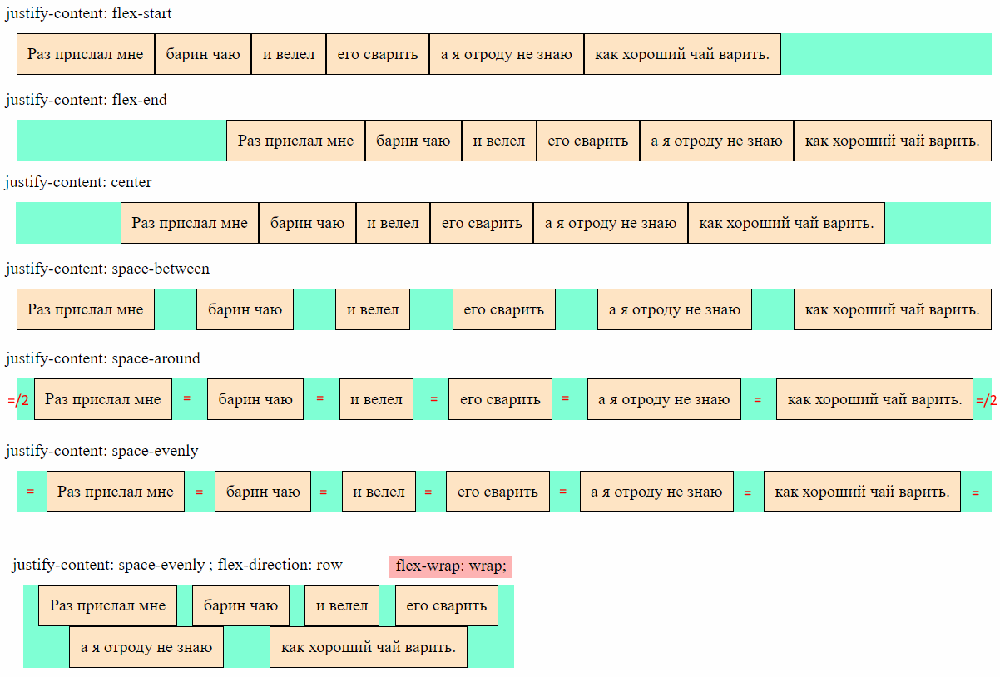
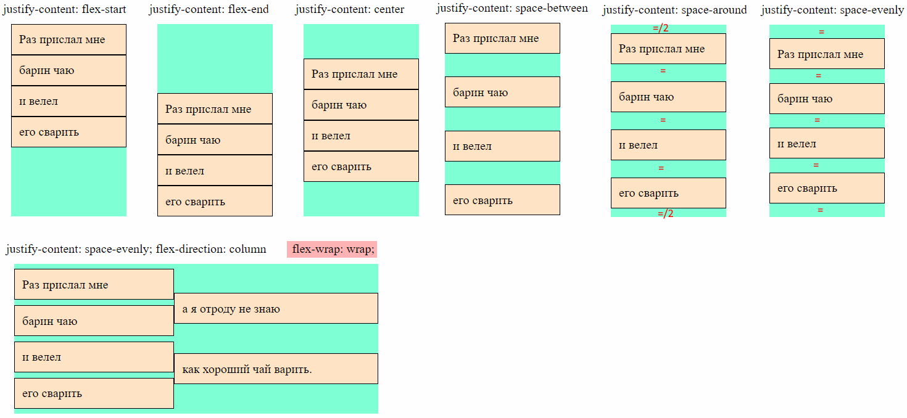
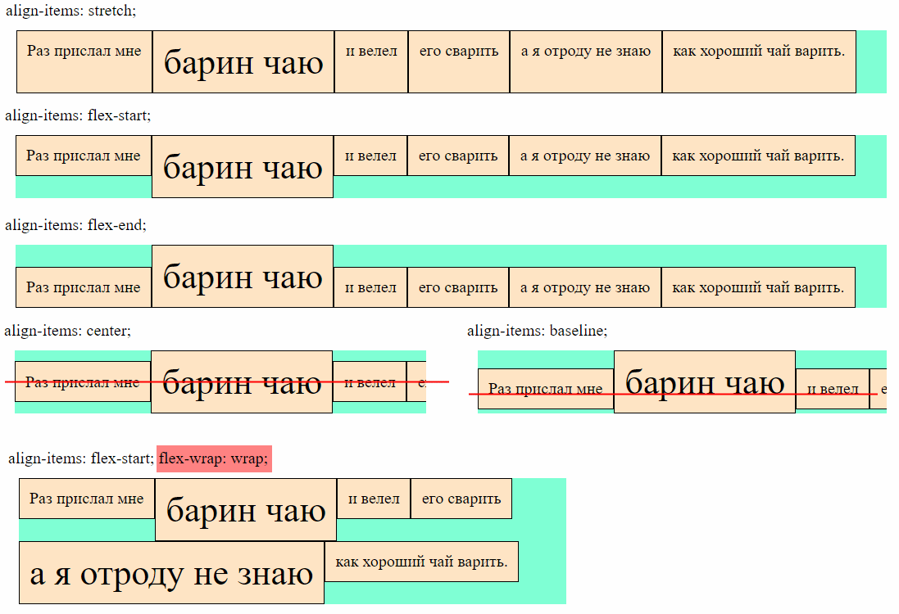
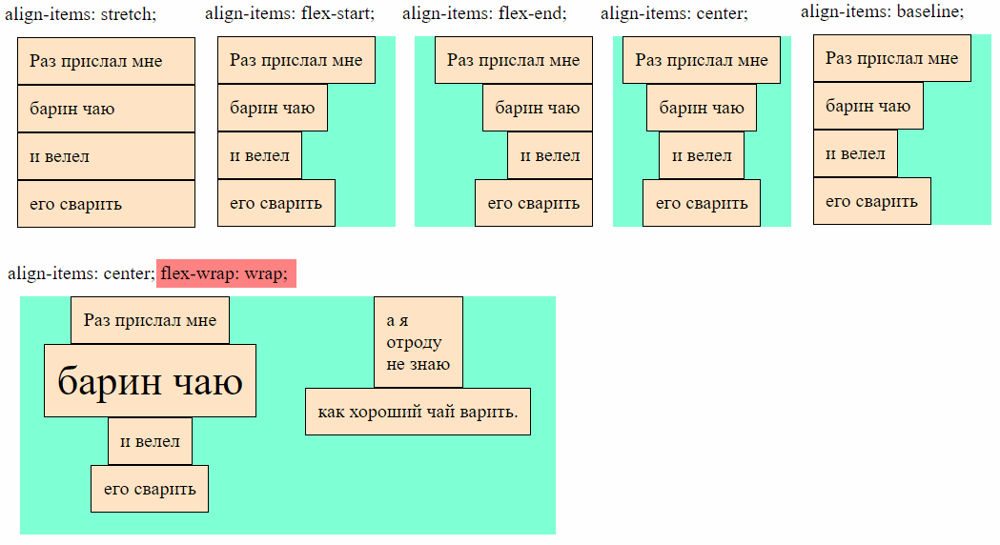
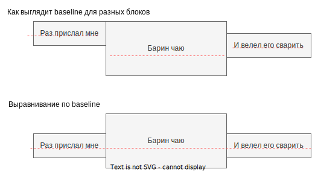
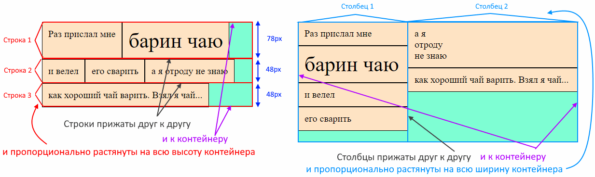
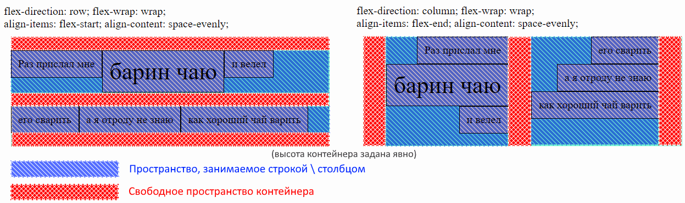
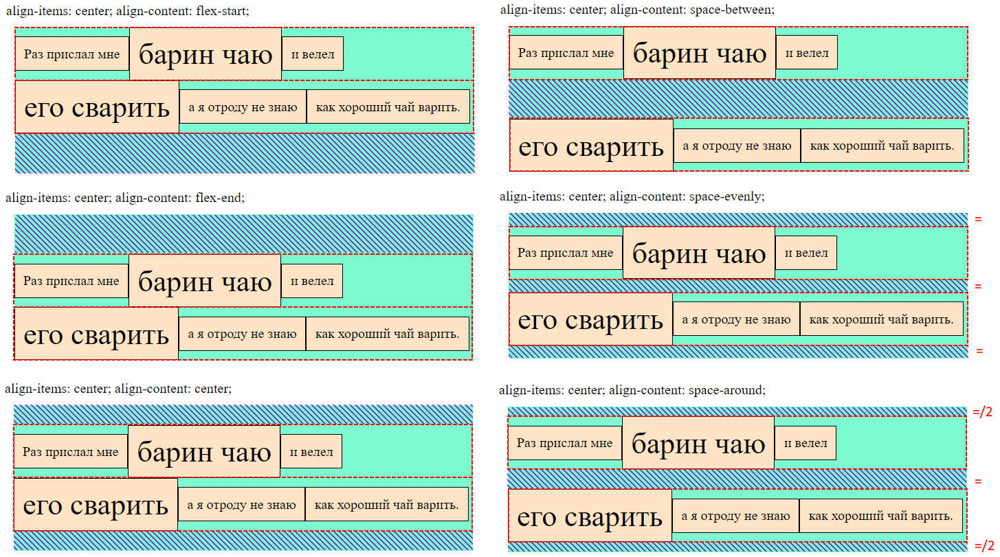
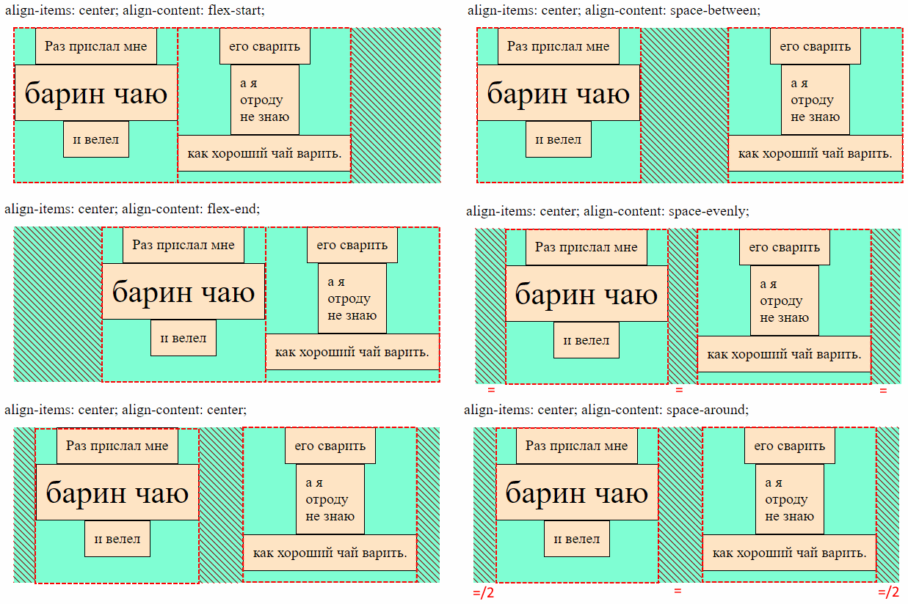

## Резюме по выравниванию во флексах

В флекс-контейнерах всего есть три вида выравнивания:

| Свойство выравнивания | Значение по умолчанию | Что делает                                                   | Документация                                                 |
| --------------------- | --------------------- | ------------------------------------------------------------ | ------------------------------------------------------------ |
| `justify-content`     | `flex-start`          | Выравнивание *элементов* внутри строки \ столбца по *основной* оси. | [MDN](https://developer.mozilla.org/en-US/docs/Web/CSS/justify-content) |
| `align-items`         | `stretch`             | Выравнивание *элементов* внутри строки \ столбца по *поперечной* оси. | [MDN](https://developer.mozilla.org/en-US/docs/Web/CSS/align-items) |
| `align-content`       | `normal`              | Выравнивание целиком *строк* \ *столбцов* по поперечной оси. | [MDN](https://developer.mozilla.org/en-US/docs/Web/CSS/align-content) |
| `justify-items`       |                       | Не работает для флексов                                      | [MDN](https://developer.mozilla.org/en-US/docs/Web/CSS/justify-items) |

Наглядная демонстрация, за выравнивание чего отвечает каждое свойство:

## Выравнивание элементов внутри строк \ столбцов

### justify-content, По основной оси

В строках \ столбцах после размещения элементов может остаться свободное место. Это дает нам возможность по-разному выровнять элементы.

► Горизонтальный контейнер:

► Вертикальный контейнер:

► Комментарии:

* `justify-content: flex-start;` - дефолт. Элементы жмутся к началу основной оси.
* `justify-content: flex-end;` - Элементы жмутся к концу основной оси.
* `justify-content: center;` - Элементы жмутся к центру основной оси.
* `justify-content: space-between;` - Боковые элементы прижимаются к краям основной оси, а остальные делят оставшееся место поровну.
* `justify-content: space-evenly;` - Между всеми элементами одинаковое расстояние, по бокам такие же отступы.
* `justify-content: space-around;` - Между всеми элементами одинаковое расстояние, а по бокам половина этого расстояния.

### align-items, По поперечной оси

Если элементы в строке \ столбце имеют разные размеры, то по умолчанию все элементы растягиваются до самого высокого \ широкого и т.о. занимают всю высоту строки \ ширину столбца. Однако можно их выровнять, чтобы они приняли свои естественные размеры.

► Горизонтальный контейнер:

► Вертикальный контейнер:

► Комментарии:

* `align-items: stretch;` - дефолт. Элементы растягиваются на всю высоту строки \ ширину столбца.
* `align-items: flex-start;` - Элементы жмутся к началу поперечной оси (к верху строки \ левому краю столбца).
* `align-items: flex-end;` - Элементы жмутся к концу поперечной оси (к низу строки \ правому краю столбца).
* `align-items: center;` - Элементы располагаются по центру поперечной оси (по вертикали по центру строки \ по горизонтали по центру столбца).
* `align-items: baseline;` - В горизонтальном контейнере выравнивает блоки по baseline, а в вертикальном контейнере не понятно. Возможно, что не работает и ведет себя как один из пунктов выше.

Baseline означает воображаемую линию, на которой лежит текст. Всякие крючки вниз, вроде как у букв `р, д, у`, и вверх как у `б, d, k` и верхние части больших букв, возвышающиеся над маленькими, находятся за пределами baseline. Понимание, что такое baseline, пригодится, чтобы понять как работает выравнивание элементов по baseline'у.

## align-content, Выравнивание строк \ столбцов внутри контейнера

Как было сказано в разделе про перенос, строки по умолчанию занимают всю высоту контейнера, а столбцы - всю ширину. И те, и другие делят пространство не поровну, а *растягиваются* пропорционально:

Мы можем выравнивать не только элементы внутри строк \ столбцов, но и сами строки и столбцы. Тогда они не будут растягиваться на всю высоту \ ширину контейнера, а выстроятся соответственно указанному выравниванию (высоту контейнера надо задать вручную, чтобы увидеть эффект, т.к. из-за того что она рассчитывается как сумма высот строк, в контейнере не будет лишнего места по вертикали).

После выравнивания строк \ столбцов, контейнер можно визуализировать вот так:

Здесь одновременно задано выравнивание и самих строк \ столбцов, и элементов внутри них.

► Горизонтальный контейнер (заштрихованным показано свободное пространство контейнера):

► Вертикальный контейнер (заштрихованным показано свободное пространство контейнера):

► Комментарии:

* `justify-content: flex-start;` - Строки \ столбцы жмутся к началу основной оси.
* `justify-content: flex-end;` - Строки \ столбцы жмутся к концу основной оси.
* `justify-content: center;` - Строки \ столбцы жмутся к центру основной оси.
* `justify-content: space-between;` - Боковые строки \ столбцы прижимаются к краям основной оси, а остальные делят оставшееся место поровну.
* `justify-content: space-evenly;` - Между всеми строками \ столбцами одинаковое расстояние, по бокам такие же отступы.
* `justify-content: space-around;` - Между всеми элементами одинаковое расстояние, а по бокам половина этого расстояния.

