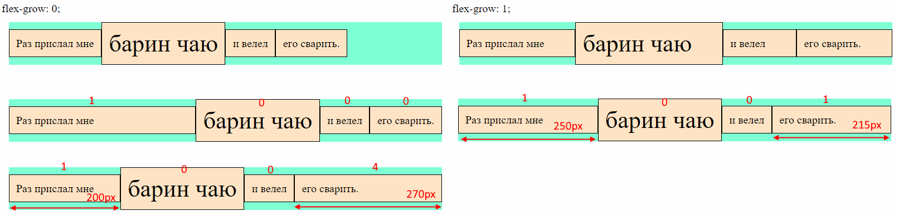
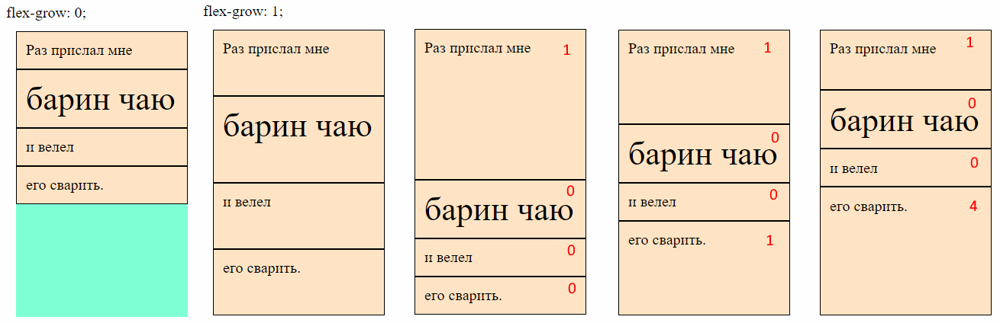
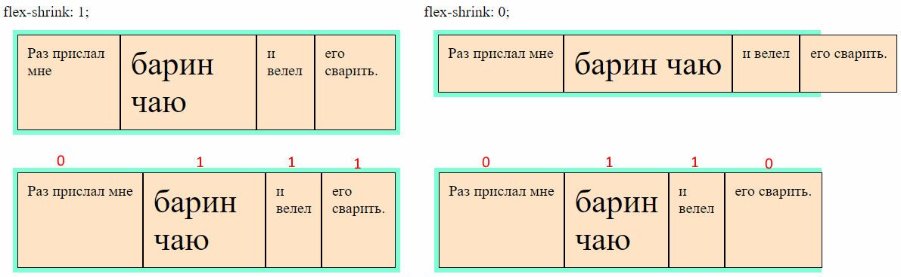
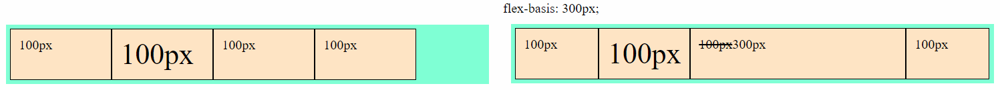
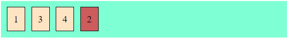

# Свойства элемента

## Растягивание и сужение

На практике:

* Растягивание обычно у всех элементов оставляют в 0, а одному элементу ставят в 1, если нужно растянуть его на *все доступное место* флекс-контейнера.
* Сужение обычно меняют на 0 тому элементу, для которого нужно оставить его естественные размеры.

### flex-grow, Растягивание

```css
.flex-element {
  flex-grow: 0;  /* По умолчанию */
}
```

Определяет, будет ли элемент пытаться растянуться, чтобы занять все свободное место по основной оси. Возможные значения - любое целое число больше или равное 0. При 0 элемент не пытается растянуться вообще, будет занимать свой естественный размер. При других значениях результат зависит, у какого элемента что указано. Если всем поставить 1, тогда они попытаются растянуться (пропорционально исходным размерам), чтобы занять все пространство по основной оси. Если у всех будет 1, а у кого-то 5, то "единичные" растянутся пропорционально, а "пятерной" попробует растянуться в пять раз больше них. Ключевое слово "попробует", потому что если другим не хватит места, то он не будет тянуться дальше остальным в ущерб.

► Горизонтальный контейнер:



► Вертикальный контейнер:



### flex-shrink, Сужение

```css
.flex-element {
  flex-shrink: 1;  /* По умолчанию */
}
```

Определяет, будет ли элемент пытаться сжаться, если в контейнере не хватает места для всех элементов. Возможные значения 0 и больше, принцип такой же как у растягивания, эти цифры - коэффициенты, определяющие пропорции между элементами.

Элемент не будет будет сужаться меньше, чем нужно для размещения контента. Грубо говоря, он может сузиться до самого длинного слова в нем, но не больше. Чтобы он мог сузиться сильнее, надо установить ему `min-width` (или `min-height`, если контейнер вертикальный).



## flex-basis, Базовый размер

```css
.flex-element {
  flex-basis: auto;  /* По умолчанию */
  flex-basis: 100px;
}
```

Задает элементу *базовый* размер. Это "стартовый" размер, который контейнер устанавливает элементу до начала распределения пространства между вложенными элементами. Он перекрывает размеры, заданные через width или height. Если направление элементов горизонтальное, то flex-basis задает ширину и перекрывает width, если вертикальное - то flex-basis задает высоту и перекрывает height.

* Значение `auto` - элемент изначально будет своего естественного размера.
* Значение `0` ([обсуждение на so](https://stackoverflow.com/questions/47578958/the-difference-between-flex-basis-auto-and-0-zero)) - элемент изначально сожмется до минимально возможного размера, при котором контент еще может влезть в него (ширина самого длинного слова например). Внимание! Это не то же самое, что установка width: 0. При width: 0 элементы сожмутся в ноль и фактически их контент визуально наложится друг на друга.



## flex, Растягивание + сужение + базис

```css
.flex-element {
  flex: 0 1 auto;  /* flex-grow, flex-shrink, flex-basis (указаны значения по умолчанию) */
}
```

Комбинированное свойство, позволяющее разом задать и растягивание, и сужение, и базовый размер.

Для свойства `flex` есть логичные предустановки, подробнее можно посмотреть [здесь](https://www.w3.org/TR/css-flexbox-1/#flex-common) (хотя как будто я и тут все написал хорошо). Они покрывают большинство стандартных сценариев:

* `flex: initial` === `flex: 0 1 auto` - дефолтное. Пока в контейнере есть свободное место, элемент имеет свои естественные размеры, не расширяется. Когда свободного места нет, он сжимается.
* `flex: auto` === `flex: 1 1 auto` - когда в контейнере есть свободное место, элемент расширяется. Когда свободного места нет, сужается.
* `flex: none` === `flex: 0 0 auto` - элемент не расширяется, и не сужается, независимо от наличия \ отсутствия свободного места в контейнере.
* `flex: положительное-число` === `flex: положительное-число 1 0` - элемент изначально будет минимального допустимого размера (т.к. flex-basis: 0), и за счет первого коэффициента растянется. Соответственно, если все элементы флекса настроить таким свойством, можно задать им пропорции растягивания. Например, не будет нужды писать нечто вроде `flex: 0 0 50%`, чтобы растянуть два элемента до одинаковой ширины. Можно написать `flex: 1` всем элементам, сколько бы их ни было, и они все будут одинаковой ширины. Все потому, что flex-basis: 0 сделает их равными с точки зрения исходного размера, а flex-grow: 1 скажет растягиваться с одинаковым приоритетом.

## order, Порядок

```css
.flex-element {
  order: 0;  /* По умолчанию */
}
```

Определяет, на каком месте визуально элемент будет находиться среди других элементов контейнера. Значение - любое целое число.

Злоупотреблять порядком и явно назначать его каждому элементу не нужно. На практике обычно используется значение `-1`, если нужно поместить элемент в начало и `1`, если нужно поместить его в конец.



```css
.el-2 {  /* Второй элемент поместим в конец */
  background-color: indianred;
  order: 1;  /* У других элементов order не задан */
}
```
